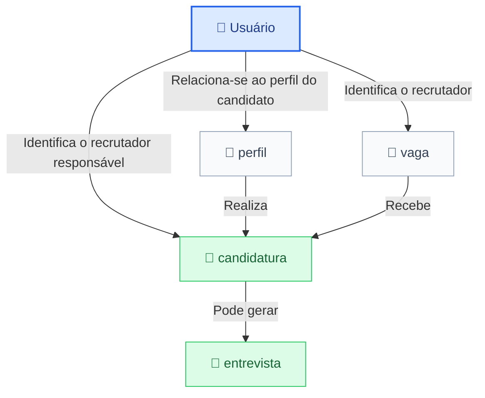

# TalentHUB — Módulo Recrutador (RH)
## Sobre o Módulo

O módulo Recrutador (RH) do TalentHUB é responsável pelo gerenciamento das vagas de emprego e pelo acompanhamento dos processos seletivos. Por meio de uma interface gráfica desenvolvida em JavaFX, o recrutador poderá administrar vagas, visualizar candidatos e candidaturas, tomar decisões sobre os processos seletivos e gerenciar entrevistas.

O acesso ao módulo será disponibilizado após a autenticação do usuário, desde que seu perfil esteja identificado como RH no banco de dados.

# Funcionalidades
## 1. Dashboard RH

O dashboard será a tela principal do recrutador, apresentando uma visão geral das atividades relacionadas ao recrutamento e à seleção.

Funcionalidades previstas:

- Visualizar a quantidade total de candidatos.
- Visualizar a quantidade de vagas cadastradas.
- Visualizar a quantidade de candidaturas recebidas.
- Visualizar a quantidade de entrevistas agendadas.
- Acompanhar os status das candidaturas.

Os indicadores serão obtidos a partir das informações armazenadas no banco de dados.

## 2. Cadastro e Gerenciamento de Vagas

O recrutador será responsável pela administração das vagas disponibilizadas no sistema.

Funcionalidades:

- Visualizar vagas: consultar as vagas cadastradas e suas informações.
- Adicionar vagas: cadastrar novas oportunidades de emprego.
- Excluir vagas: remover vagas cadastradas, respeitando as regras de integridade do banco de dados.

As informações de uma vaga poderão incluir:

- Título.
- Descrição.
- Requisitos.
- Carga horária.
- Salário.
- Status da vaga.
- Data de publicação.

As vagas serão armazenadas na tabela vaga do banco de dados.

## 3. Visualização de Candidatos

O recrutador poderá consultar os dados dos candidatos que participam dos processos seletivos.

Funcionalidades:

- Visualizar a lista de candidatos.
- Consultar informações de perfil e contato.
- Visualizar perfil de plataformas anexadas (caso informado).
- Acessar o currículo enviado pelo candidato.

Os dados serão obtidos por meio das tabelas usuario e perfil, relacionadas pelo identificador do usuário.

O acesso aos dados pessoais e aos currículos deverá respeitar as permissões do sistema e a finalidade do processo seletivo.

## 4. Gerenciamento de Candidaturas

O recrutador poderá visualizar e acompanhar as candidaturas recebidas para as vagas cadastradas.

Funcionalidades:

- Listar candidaturas recebidas.
- Consultar a vaga relacionada a cada candidatura.
- Consultar a pretensão salarial e a carga horária desejada.
- Verificar o status atual da candidatura.

As candidaturas serão armazenadas na tabela candidatura, que relaciona o candidato à vaga correspondente.

## 5. Aprovação e Recusa de Candidaturas

Após analisar uma candidatura, o recrutador poderá aprová-la ou recusá-la.

| STATUS | PREVISTO |
| -----------------------------| -----------------------------|
| PENDENTE | candidatura aguardando análise |
| APROVADA | candidatura aprovada pelo recrutador |
| REJEITADA | candidatura recusada pelo recrutador |

Aprovar candidatura:

Atualizar o status para APROVADA.
Registrar a data e hora da decisão.
Registrar o identificador do recrutador responsável.

Recusar candidatura:

Atualizar o status para REJEITADA.
Registrar a data e hora da decisão.
Registrar o identificador do recrutador responsável.

Essas operações serão realizadas na tabela candidatura, utilizando os campos status, data_ultima_acao e id_rh_responsavel.

## 6. Agendamento de Entrevistas

O recrutador poderá agendar entrevistas para candidaturas em processo seletivo.

Funcionalidades:

- Selecionar a candidatura relacionada.
- Definir a data da entrevista.
- Definir o horário da entrevista.
- Consultar as entrevistas cadastradas.

Os registros serão armazenados na tabela entrevista, relacionados à candidatura correspondente por meio do campo id_candidatura.

Cada entrevista possuirá um status:

| STATUS | PREVISTO |
| -----------------------------| -----------------------------|
| AGENDADA | entrevista programada |
| REALIZADA | entrevista concluída |
| CANCELADA | entrevista cancelada |

## 7. Gerenciamento de Entrevistas

O recrutador poderá acompanhar os agendamentos existentes.

Funcionalidades:

- Visualizar a lista de entrevistas.
- Consultar o candidato e a vaga relacionados.
- Consultar a data e o horário agendados.
- Verificar o status da entrevista.
- Cancelar entrevistas previamente agendadas.

Ao cancelar uma entrevista, seu status será atualizado para CANCELADA, preservando o registro para consulta posterior.

Organização das Telas

A interface gráfica do módulo será desenvolvida com JavaFX e poderá ser organizada da seguinte maneira:

# Módulo Recrutador (RH)

Diagrama das funcionalidades disponíveis para o recrutador no sistema.

```mermaid
flowchart TD
    A["👤 Módulo Recrutador (RH)"]

    A --> B["📊 Dashboard RH"]
    A --> C["📋 Vagas"]
    A --> D["📝 Candidaturas"]
    A --> E["📅 Entrevistas"]

    B --> B1["Total de candidatos"]
    B --> B2["Total de vagas"]
    B --> B3["Total de candidaturas"]
    B --> B4["Total de entrevistas"]

    C --> C1["Listar vagas"]
    C --> C2["Cadastrar vaga"]
    C --> C3["Excluir vaga"]

    D --> D1["Listar candidaturas"]
    D --> D2["Visualizar detalhes"]
    D --> D3["Aprovar candidatura"]
    D --> D4["Recusar candidatura"]

    E --> E1["Listar entrevistas"]
    E --> E2["Visualizar detalhes"]
    E --> E3["Cancelar entrevista"]

    classDef principal fill:#1D4ED8,color:#FFFFFF,stroke:#1E3A8A,stroke-width:2px
    classDef modulo fill:#DBEAFE,color:#1E3A8A,stroke:#60A5FA,stroke-width:1px
    classDef funcionalidade fill:#F8FAFC,color:#334155,stroke:#CBD5E1,stroke-width:1px

    class A principal
    class B,C,D,E modulo
    class B1,B2,B3,B4,C1,C2,C3,D1,D2,D3,D4,E1,E2,E3 funcionalidade
```

## Funcionalidades do módulo

* **Dashboard RH:** acompanhamento dos indicadores gerais.
* **Vagas:** gerenciamento das vagas disponíveis.
* **Candidaturas:** análise, aprovação e recusa de candidatos.
* **Entrevistas:** consulta aos agendamentos e cancelamento de entrevistas.

    
# Tecnologias Utilizadas

| Tecnologia/Ferramenta             | O que é                                                                   |
| --------------------------------- | ------------------------------------------------------------------------- |
| **Java**                          | Linguagem de programação principal do sistema.                            |
| **JDK**                           | Kit necessário para desenvolver e executar aplicações Java.               |
| **JavaFX**                        | Framework utilizado para desenvolver a interface gráfica.                 |
| **MySQL Community Server**        | Sistema de gerenciamento do banco de dados.                               |
| **MySQL Connector/J**             | Driver JDBC utilizado para a comunicação entre Java e MySQL.              |
| **Maven**                         | Ferramenta para gerenciamento do projeto e suas dependências.             |
| **Git**                           | Sistema de controle de versões.                                           |
| **GitHub**                        | Plataforma utilizada para hospedagem e colaboração do projeto.            |
| **Visual Studio Code**            | Editor utilizado para desenvolvimento do sistema.                         |
| **SQLTools**                      | Extensão utilizada para acessar e gerenciar bancos de dados pelo VS Code. |
| **SQLTools MySQL/MariaDB Driver** | Driver utilizado pelo SQLTools para conexão com o MySQL.                  |
| **GitLens**                       | Extensão que adiciona recursos ao gerenciamento de versões com Git.       |

# 8 - Utilização do módulo em SQL:

O módulo Recrutador do TalentHub utiliza cinco tabelas principais para gerenciar usuários, perfis de candidatos, vagas, candidaturas e entrevistas.

